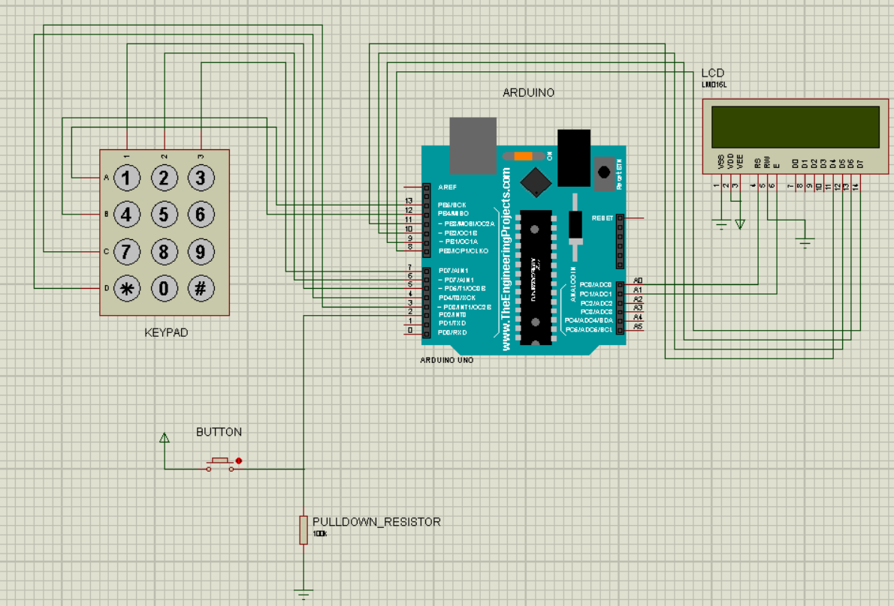

# PasswordBoard

A basic embedded security system.

The implemented system consists of an Arduino, 16x2 alphanumeric display, 4x3 keypad and a push button. 
A default password is hard coded in the Arduino code and users can enter a password using the keypad. Every time they press a button a star symbol is displayed on the LCD. When they entered the desired password, they can submit the password by pressing '*' on the keypad. They can also edit the entered password by pressing '#' which deletes the last character on each press.

The button acts as a toggle switch for showing the password. If the entered password is invisible and a user presses the button the LCD should be cleared, and the entered password must be printed on it. When the password is visible and user presses the button, LCD should be cleared, and a star symbol should be printed for each entered number.

After submitting the password two scenarios happen: the password is either correct or wrong. If the password is correct “Access is granted” will be displayed on the LCD and if it is wrong, “Wrong password” will be displayed. In either case the message would disappear after one second and the system would receive new input again.

The board of this system looks like this:

